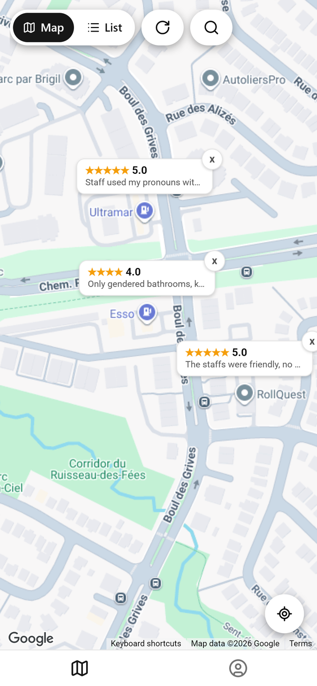
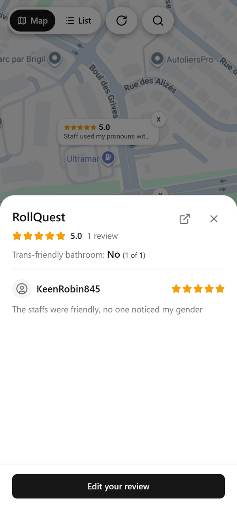
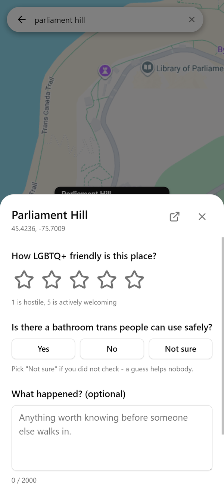
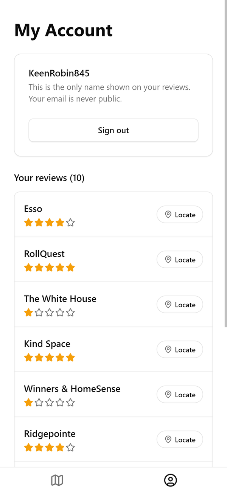
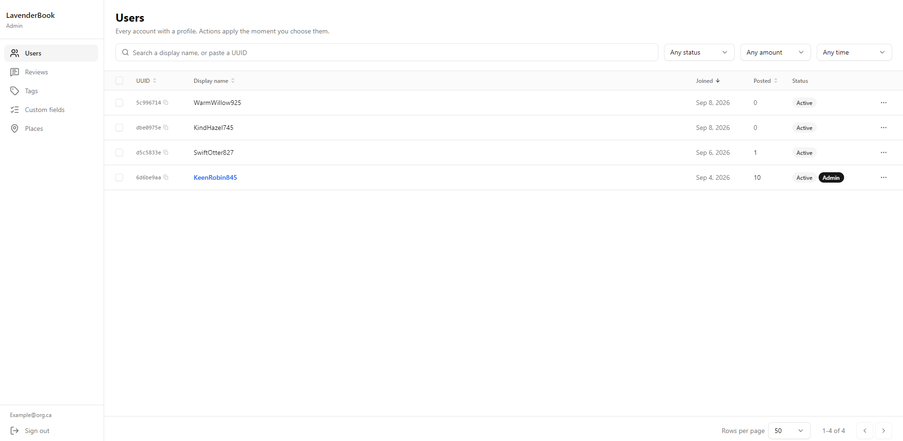
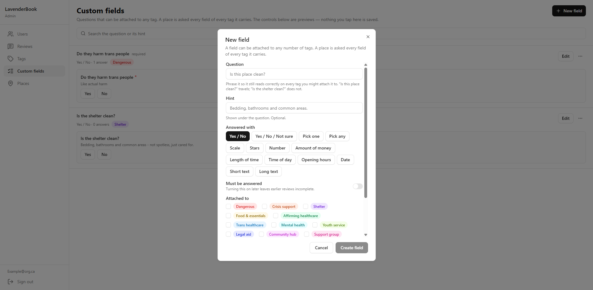

# LavenderBook

LavenderBook is a community-maintained map of how safe and welcoming real places are for
LGBTQ+ people, and for trans people in particular. Anyone can open the map and see what
others have reported about the venues around them. Signed-in members can add a rating of
their own. Staff at the commissioning organisation use a separate, web-only administration
panel to label places, record what the organisation has verified about them, and decide
which questions visitors are asked about each kind of place.

The same codebase runs on Android, iOS and the web.

## What it does

### For visitors

- **A map of rated places.** Venues near you are drawn on the map with their current
  rating. The same set can be read as a list instead, for anyone who finds a list easier
  than a map.
- **Search for anywhere.** The search box covers every place Google knows about, not only
  places already in LavenderBook, so a venue can be looked up and reviewed the first time
  anybody visits it.
- **A rating that means one thing.** The five stars measure LGBTQ friendliness and nothing
  else — 1 is hostile, 5 is actively welcoming. It is not a rating of the food or the
  service.
- **A trans bathroom question** on every review: yes, no, or not sure.
- **Questions specific to the kind of place.** A shelter is asked about curfews, beds and
  pets; a café is not. The questions are set by administrators, per label, and can be
  changed without a new release of the app.
- **Answers that add up.** Because many people answer the same question, a venue's page
  shows the pattern — "nine of eleven people said there is no curfew" — rather than eleven
  separate opinions.
- **What the organisation knows.** Notes written by staff appear on a venue alongside the
  community's reviews, and are clearly the organisation's own statements.
- **Your own reviews, in one place.** The account tab lists everything you have posted,
  with a link back to each venue on the map. A review can be edited or deleted at any time.
- **Live updates.** A review posted by someone else appears on an open map without a
  refresh.
- **Directions**, handed off to the device's usual maps application.

### For the organisation

- **Label a place.** Shelter, hub, clinic — a place can carry more than one label. Labelling
  is what switches on that place's questions and notes.
- **Write what you have verified.** Free-form bullet points on a specific venue: opening
  hours confirmed by phone, which door to use, who to ask for at reception.
- **Write the questions.** Fourteen kinds of question are supported — yes/no, yes/no/unsure,
  single and multiple choice, a sliding scale, a star rating, a number, an amount of money,
  a duration, a time, a time range, a date, and short or long free text.
- **Moderate.** Reviews can be searched, filtered, edited or removed. An edit made by an
  administrator is recorded as such, so it is never mistaken for the author's own change.
- **Manage accounts.** Search the membership, suspend an account, and grant or revoke
  administrator access.

## Screenshots

| | |
| --- | --- |
|  |  |
| The map, with nearby venues and their ratings | A venue: its rating, the bathroom tally, and what people wrote |
|  |  |
| Writing a review, including the venue's own questions | The account tab and your own reviews |

## The admin panel

The panel is a web page at `/admin`. It is deliberately not part of the mobile application
at all: on a phone the route redirects to the map, and none of the panel's code is included
in the mobile build.





There is no administrator password anywhere in this project, and no shared secret to
circulate. An administrator is an ordinary account that has been added to a list held in
the database; every action the panel takes is re-checked against that list by the database
itself before it is carried out. Loading the page is not what grants access, so a page
loaded by someone who is not an administrator is simply empty.

## Privacy and safety

- **Reviews are pseudonymous.** Every account is issued a generated display name such as
  `SamAltman123`, and no account details are shown on a review.
- **Reviews cannot be linked to each other by name.** With *per-place names*, on by
  default, each review is shown under a name generated for it alone, so nobody can collect
  one person's reviews and narrow down where they live, work or go. Administrators can
  still see which account posted a review. Turning the setting off affects only later
  reviews; it never reattaches an account name to a review that already has its own.
- **No exact times are published.** The time a review was posted is never served to the
  public, so it cannot be matched against location data from apps, advertisers or phone
  companies. With *hidden dates*, also on by default, a review shows only a rough period
  such as "a few weeks ago", counted in whole weeks so that even someone checking
  repeatedly learns no more than the week. With it off, readers see the day but never the
  time. Each review keeps the setting it was posted with. New reviews still appear on the
  map straight away; only administrators can see exactly when one was posted.
- **Location is optional, and stays on the phone.** The map can follow you as you walk, but
  it doesn't have to: you can start it at a general area worked out from your phone's time
  zone, or at a city you pick, and nothing else changes - including posting reviews. When
  it does follow you, your exact position never leaves the phone. To load nearby places it
  sends only the rough block you're in (a 250 m square), and never with your account
  attached. The choice is saved on the device, not on your account.
- **Email addresses are never public.** They are held by the authentication service and are
  not shown to other members.
- **Account identifiers stay private.** An account's internal id, sign-up date and
  suspension date are never served to the public API — only the account itself and
  administrators can read them. Nor is which administrator made a given change.
- **The public cannot sign themselves up as staff.** Everyone signs in with Google,
  administrators included; an account becomes an administrator only when it is added to
  the administrator list, by hand or by an existing administrator.
- **Access is enforced in the database, not in the interface.** Row-level security governs
  what any given account can read and write, and each administrative action has its own
  permission check on the server.
- **Suspension actually stops something.** A suspended account is refused at the database,
  not merely hidden in the app.
- **The Google Places key is never shipped.** Place lookups are proxied through two small
  server functions so that the billable key stays on the server, out of the published web
  page and out of the Android package.

## Running it locally

### Prerequisites

- Node.js 20 or newer, and npm
- A Supabase project (the free plan is sufficient)
- A Google Cloud project with the **Maps SDK for Android** and the **Places API (New)**
  enabled
- For Android builds: Android Studio and JDK 17, or an Expo account if you would rather
  build in the cloud

### 1. Install dependencies

```bash
npm install
```

### 2. Configure the application

Copy the example environment file and fill it in from your Supabase project's
**Project Settings → API**:

```bash
cp .env.example .env
```

On Windows, use `copy .env.example .env`.

```
EXPO_PUBLIC_SUPABASE_URL=https://<project-ref>.supabase.co
EXPO_PUBLIC_SUPABASE_ANON_KEY=<anon-public-key>
```

Only publishable values belong in this file. Everything prefixed `EXPO_PUBLIC_` is compiled
into the application and is readable by anybody who has it; the service-role key must never
be placed here.

The two Google Maps keys go in the same file. Neither is a secret — the web one is
compiled into the JavaScript bundle, and the Android one is written into the app's manifest
where the Maps SDK reads it — so both must be restricted in the Google Cloud console
instead: the web key by HTTP referrer, and the Android key by package name and signing
certificate.

```
EXPO_PUBLIC_GOOGLE_MAPS_WEB_KEY=<maps-js-api-key>
GOOGLE_MAPS_ANDROID_KEY=<maps-sdk-for-android-key>
```

`GOOGLE_MAPS_ANDROID_KEY` has no `EXPO_PUBLIC_` prefix on purpose. It is read once by
`app.config.js` at build time and written into the manifest, so it never needs to reach the
JavaScript bundle. Because `.env` is not uploaded to EAS, cloud builds need the same
variable set as an EAS environment variable.

### 3. Set up the database

```bash
npx supabase link --project-ref <project-ref>
```

```bash
npx supabase db push
```

`db push` applies every migration in `supabase/migrations/` in order. It is the only
supported way to apply them.

### 4. Deploy the server functions

```bash
npx supabase secrets set GOOGLE_PLACES_KEY=<your-places-api-key>
```

```bash
npx supabase functions deploy places-search
```

```bash
npx supabase functions deploy place-details
```

### 5. Configure authentication

In the Supabase dashboard, under **Authentication → Providers**:

- **Google** — enabled. This is how everyone signs in, administrators included.
- **Email** — disabled. Nothing in the application signs in with a password.

### 6. Run it

```bash
npm run web
```

```bash
npm run android
```

```bash
npm run ios
```

The application uses native modules and build-time configuration, so it will not run in the
Expo Go sandbox; `npm run android` and `npm run ios` compile a development build of their
own. The web version needs no build tooling beyond Node.

The iOS target has not yet been given a bundle identifier in `app.json`, so it runs in
development but is not yet configured for distribution.

## Creating the first administrator

There is deliberately no way to do this from inside the application.

1. Sign in to the application with Google, using the account that should become the
   administrator. This creates the account.
2. In the Supabase dashboard's **SQL Editor**, add that account to the administrator list,
   using its Google address:

   ```sql
   insert into public.admins (user_id, note)
   select id, 'founder' from auth.users where email = 'you@example.com';
   ```

3. Open `/admin` in a browser and choose **Continue with Google**.

From then on, administrators are granted and revoked from **Users** inside the panel. The
panel refuses to let an administrator revoke their own access, so it cannot be left with
nobody able to use it.

Full context is in the header comment of
`supabase/migrations/20260911061500_admin_roles_and_moderation.sql`.

## Building for release

The web build, which includes the administration panel, is a folder of static files that
can be hosted anywhere:

```bash
npx expo export --platform web
```

The output is written to `dist/`.

Android packages are built through Expo Application Services. Cloud builds do not receive
your `.env`, so set the Android Maps key on EAS once before the first build:

```bash
eas env:set --name GOOGLE_MAPS_ANDROID_KEY --environment production --environment preview
```

An installable test build:

```bash
eas build --profile preview --platform android
```

A store build:

```bash
eas build --profile production --platform android
```

## Keeping the database awake

Supabase pauses free-plan projects after roughly a week of inactivity. The repository
includes a scheduled GitHub Actions workflow that queries the database twice a week to
prevent this. It requires two repository secrets, set under
**Settings → Secrets and variables → Actions**: `SUPABASE_URL` and `SUPABASE_ANON_KEY`.
The workflow can also be run on demand from the Actions tab.

This is unnecessary on a paid plan.

## Project layout

```
src/
  app/                    Screens and routes
    (tabs)/               The map and account tabs
    admin.web.tsx         The administration panel (web only)
  components/
    admin/                Panel sections: users, reviews, tags, questions, places
    ui/                   Shared interface components
  lib/                    Data access, authentication, helpers
supabase/
  migrations/             Database schema, in order
  functions/              Server functions for Google Places lookups
docs/                     Design notes
  screenshots/            The images used in this file
assets/                   Icons and images
.github/workflows/        Scheduled maintenance
app.json                  Static app configuration
app.config.js             Injects the Android Maps key from the environment
```

## Stack

**Application**

- Expo SDK 57
- React Native 0.86
- React 19.2
- TypeScript
- Expo Router

**Interface**

- NativeWind 4
- Tailwind CSS 3
- react-native-reusables
- Lucide
- React Native Reanimated

**Maps and places**

- react-native-maps
- @vis.gl/react-google-maps
- Google Maps Platform
- Google Places API

**Backend**

- Supabase
- PostgreSQL
- PostgREST
- Supabase Auth
- Supabase Realtime
- Deno

**Build**

- EAS Build
